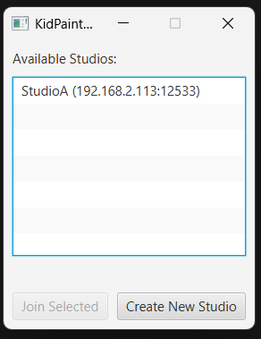
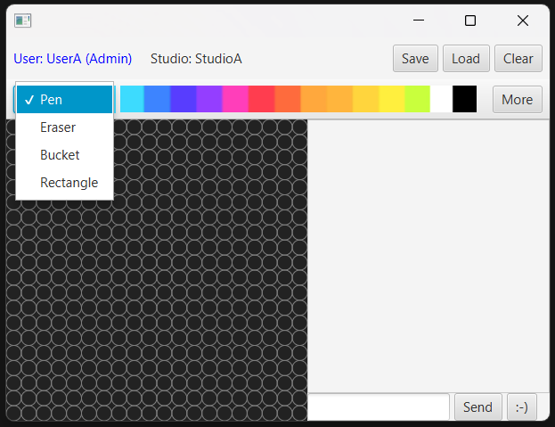
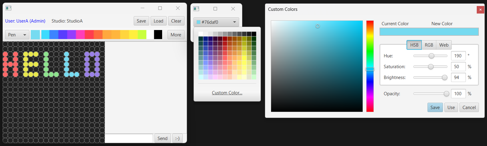
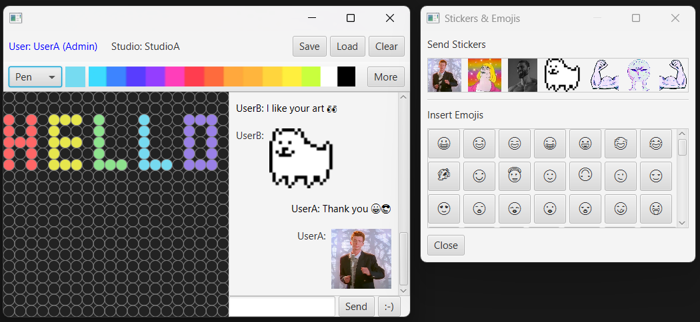
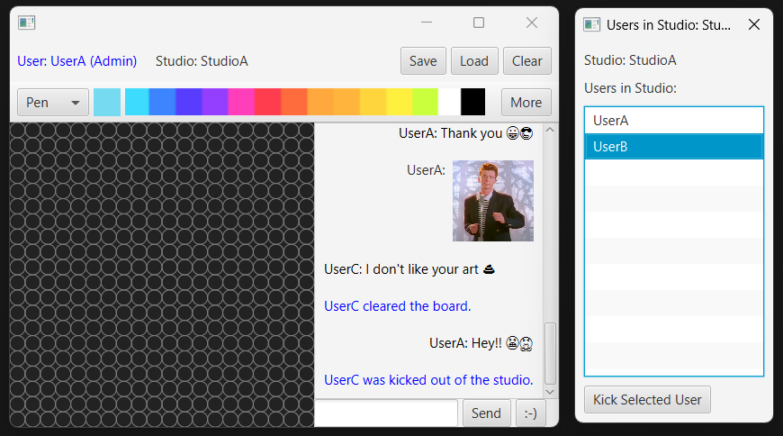

# KidPaint2: Peer-to-Peer Collaborative Drawing App

## Overview

KidPaint2 is an enhanced version of a simple paint application designed for kids. The core functionality allows multiple users to collaboratively draw on shared canvases over a local network using a peer-to-peer (P2P) architecture. Users can create or join "studios" (separate drawing sessions), synchronize sketches in real-time, chat with others in the same studio, and utilize additional tools for an engaging experience.

The KidPaint app in this project builds network features for multi-user collaboration, including UDP broadcasting for studio discovery and TCP connections for data synchronization. It supports differential updates for efficient drawing synchronization and confines interactions to specific studios, enabling isolated group collaborations on the same local subnet.

## Key Features

### Core Networking (Peer-to-Peer Approach)
- **Studio Creation and Joining**: Users can create new studios or join existing ones discovered via UDP broadcasting.
- **Real-Time Synchronization**: Drawing updates, chat messages, and canvas changes are broadcast only to users in the same studio.
- **No Central Server Dependency**: Each studio host acts as a server-client hybrid, handling connections and data transmission among peers.
- **Save/Load Functionality**: Save sketches to local files or load previous ones, with changes synchronized across the studio.

### Additional Features
- **Save Button**: Save the drawing layer as a KPB file.
- **Clear Button**: Reset the entire canvas for all users in the studio, with an automatic chat notification (e.g., "[User] cleared the board").
- **Emojis and Stickers Support**: Send emojis or stickers in the chat for expressive communication.
- **Extended Colour Palette**: Access additional colors via a "More" button, customizable in HSB, RGB, or Hex formats.
- **Admin Control**: Studio creators (admins) can view participant lists and kick disruptive users.

## Technologies Used
- **Language**: Java
- **IDE**: IntelliJ
- **Networking**: UDP for discovery, TCP for data transfer

## How to Run
1. **Prerequisites**: Ensure all devices are on the same local subnet. Java Runtime Environment (JRE) is required.
2. **Launch the Application**:
   - Run `KidPaint` on multiple computers.
   - Enter a username when prompted.
   - Choose to join an existing studio (select from discovered list and click "Join Selected") or create a new one (enter studio name).
3. **Drawing and Collaboration**:
   - Select tools (pen, bucket, eraser, rectangle) from the dropdown.
   - Draw on the canvas; changes sync in real-time.
   - Use the chat box for messages, emojis, or stickers.
   - Admins: Click the blue admin name text to manage users.
4. **Save/Load**:
   - Click "Save" to store the sketch locally.
   - Click "Load" to upload a saved file, syncing it to the studio.

**Note**: The app does not require manual IP/port input; discovery is automatic via UDP.

## Screenshots
- **Studio Selection**:

- **Tool Selection**:

- **Colour Palette**:

- **Emojis/Stickers**:

- **Admin Control**:

## License
This project is for educational purposes only. No license is specified; feel free to use it as a reference for learning networking concepts in Java.

## Acknowledgments
Based on the original KidPaint app provided for the COMP3015 course. Thanks to the course instructors for the project guidelines.

For any issues or questions, contact the group leader.